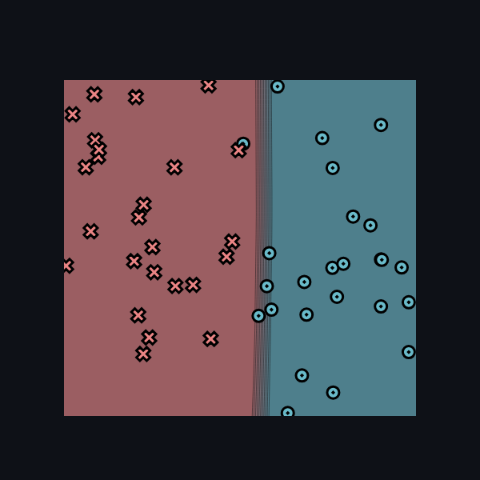
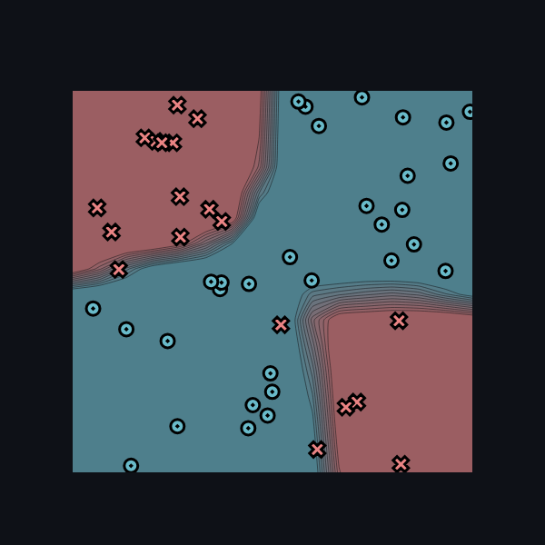
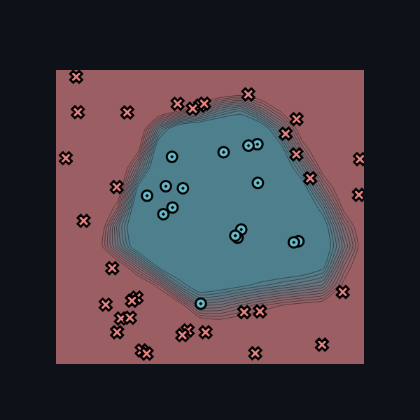
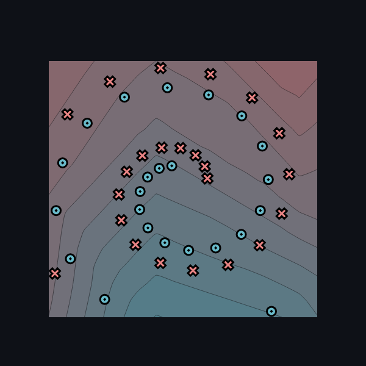

# Task 1.5

## Settings

* **Size of hidden layers**: 10
* **Learning rate**: 0.5
* **Number of epochs**: 500

## Training results

### Simple

**logs**

```
Epoch: 10/500, loss: 19.476002900434487, correct: 45
Epoch: 20/500, loss: 10.677005441558919, correct: 46
Epoch: 30/500, loss: 7.271160792971534, correct: 49
Epoch: 40/500, loss: 5.947010226675681, correct: 48
Epoch: 50/500, loss: 18.820112449228485, correct: 43
Epoch: 60/500, loss: 4.7508186366027125, correct: 49
Epoch: 70/500, loss: 3.9114721282571754, correct: 49
Epoch: 80/500, loss: 3.4910132504379483, correct: 49
Epoch: 90/500, loss: 3.221385425379461, correct: 50
Epoch: 100/500, loss: 4.555050627028468, correct: 47
Epoch: 110/500, loss: 9.3946025025401, correct: 46
Epoch: 120/500, loss: 3.513865117883062, correct: 48
Epoch: 130/500, loss: 2.8822345360129815, correct: 49
Epoch: 140/500, loss: 2.7866615198023537, correct: 49
Epoch: 150/500, loss: 3.291078352255772, correct: 48
Epoch: 160/500, loss: 5.676786721391559, correct: 47
Epoch: 170/500, loss: 4.588392795023389, correct: 47
Epoch: 180/500, loss: 2.756147562433705, correct: 49
Epoch: 190/500, loss: 2.39425467278303, correct: 49
Epoch: 200/500, loss: 2.3935009849588997, correct: 49
Epoch: 210/500, loss: 2.7722514748436025, correct: 49
Epoch: 220/500, loss: 3.6446716894241256, correct: 48
Epoch: 230/500, loss: 3.7392644662805417, correct: 48
Epoch: 240/500, loss: 2.7436652814775675, correct: 48
Epoch: 250/500, loss: 2.345871419407763, correct: 49
Epoch: 260/500, loss: 2.343155909681734, correct: 49
Epoch: 270/500, loss: 2.492036085730196, correct: 49
Epoch: 280/500, loss: 2.647053442945021, correct: 49
Epoch: 290/500, loss: 2.641235542844373, correct: 49
Epoch: 300/500, loss: 2.520111599191161, correct: 49
Epoch: 310/500, loss: 2.42069919108889, correct: 49
Epoch: 320/500, loss: 2.377340049414172, correct: 49
Epoch: 330/500, loss: 2.354213982076483, correct: 49
Epoch: 340/500, loss: 2.3322060965469964, correct: 49
Epoch: 350/500, loss: 2.308281762432677, correct: 49
Epoch: 360/500, loss: 2.27793803436063, correct: 49
Epoch: 370/500, loss: 2.2451750933180215, correct: 49
Epoch: 380/500, loss: 2.2219098141185274, correct: 49
Epoch: 390/500, loss: 2.1984791285482723, correct: 49
Epoch: 400/500, loss: 2.1673803565450442, correct: 49
Epoch: 410/500, loss: 2.1467739501951875, correct: 49
Epoch: 420/500, loss: 2.1296808452333766, correct: 49
Epoch: 430/500, loss: 2.106184796590444, correct: 49
Epoch: 440/500, loss: 2.0857210781038225, correct: 49
Epoch: 450/500, loss: 2.0657364448617432, correct: 49
Epoch: 460/500, loss: 2.0460199646037354, correct: 49
Epoch: 470/500, loss: 2.0266706259230802, correct: 49
Epoch: 480/500, loss: 2.007810915748722, correct: 49
Epoch: 490/500, loss: 1.9903639741319645, correct: 49
Epoch: 500/500, loss: 1.9718636651625314, correct: 49
```

**Final image**



### Xor

**logs**

```
Epoch: 10/500, loss: 25.979025841298412, correct: 43
Epoch: 20/500, loss: 28.128463332129435, correct: 35
Epoch: 30/500, loss: 23.80280248692299, correct: 38
Epoch: 40/500, loss: 22.628327028947933, correct: 38
Epoch: 50/500, loss: 22.73198058679777, correct: 36
Epoch: 60/500, loss: 18.309821019650546, correct: 44
Epoch: 70/500, loss: 20.291743596177213, correct: 40
Epoch: 80/500, loss: 17.898530690852198, correct: 41
Epoch: 90/500, loss: 14.44260247335654, correct: 46
Epoch: 100/500, loss: 16.70099964020998, correct: 43
Epoch: 110/500, loss: 18.24834772778816, correct: 38
Epoch: 120/500, loss: 11.627212509034221, correct: 46
Epoch: 130/500, loss: 13.986941587493268, correct: 45
Epoch: 140/500, loss: 10.099625753398023, correct: 47
Epoch: 150/500, loss: 12.283147438782837, correct: 47
Epoch: 160/500, loss: 19.075861851956404, correct: 36
Epoch: 170/500, loss: 15.693764074276096, correct: 39
Epoch: 180/500, loss: 9.617735917986819, correct: 48
Epoch: 190/500, loss: 8.093198722466267, correct: 47
Epoch: 200/500, loss: 7.9353667414182265, correct: 47
Epoch: 210/500, loss: 7.69350342882537, correct: 48
Epoch: 220/500, loss: 5.809605130868755, correct: 49
Epoch: 230/500, loss: 6.641619252159511, correct: 48
Epoch: 240/500, loss: 5.748310996297892, correct: 49
Epoch: 250/500, loss: 4.838146181387634, correct: 49
Epoch: 260/500, loss: 6.95506061397935, correct: 46
Epoch: 270/500, loss: 4.278045211587566, correct: 49
Epoch: 280/500, loss: 4.372867310018147, correct: 49
Epoch: 290/500, loss: 4.625740158851036, correct: 49
Epoch: 300/500, loss: 4.213219881305561, correct: 49
Epoch: 310/500, loss: 4.184453813445513, correct: 49
Epoch: 320/500, loss: 10.684411134772876, correct: 44
Epoch: 330/500, loss: 12.967340228702552, correct: 46
Epoch: 340/500, loss: 10.262351354272957, correct: 45
Epoch: 350/500, loss: 10.269381696272244, correct: 45
Epoch: 360/500, loss: 13.714946067229512, correct: 43
Epoch: 370/500, loss: 10.777093999543002, correct: 45
Epoch: 380/500, loss: 8.814710605129205, correct: 47
Epoch: 390/500, loss: 12.351595794002721, correct: 44
Epoch: 400/500, loss: 5.2899458167935505, correct: 49
Epoch: 410/500, loss: 8.948797945085072, correct: 44
Epoch: 420/500, loss: 3.8268158440621844, correct: 49
Epoch: 430/500, loss: 5.467257923248081, correct: 49
Epoch: 440/500, loss: 3.474715366808928, correct: 49
Epoch: 450/500, loss: 3.5081840869815486, correct: 50
Epoch: 460/500, loss: 11.103343684297121, correct: 44
Epoch: 470/500, loss: 2.28737853247554, correct: 50
Epoch: 480/500, loss: 1.9610089520132816, correct: 50
```

**images**



### Circle

**logs**

```
Epoch: 10/500, loss: 29.247521495582397, correct: 34
Epoch: 20/500, loss: 27.981192722456093, correct: 34
Epoch: 30/500, loss: 27.009488553777615, correct: 34
Epoch: 40/500, loss: 25.56528114419763, correct: 34
Epoch: 50/500, loss: 24.614452351680264, correct: 42
Epoch: 60/500, loss: 24.109435845539355, correct: 42
Epoch: 70/500, loss: 24.05131177264955, correct: 43
Epoch: 80/500, loss: 23.851578140515656, correct: 40
Epoch: 90/500, loss: 19.915773911215272, correct: 41
Epoch: 100/500, loss: 23.78213775447345, correct: 36
Epoch: 110/500, loss: 18.045229893481068, correct: 42
Epoch: 120/500, loss: 18.98540464431737, correct: 43
Epoch: 130/500, loss: 17.037496834819052, correct: 42
Epoch: 140/500, loss: 19.150116119344837, correct: 43
Epoch: 150/500, loss: 15.823062126215284, correct: 45
Epoch: 160/500, loss: 19.905952230423733, correct: 42
Epoch: 170/500, loss: 15.385960517899031, correct: 45
Epoch: 180/500, loss: 19.62326156552919, correct: 38
Epoch: 190/500, loss: 14.070955880523895, correct: 46
Epoch: 200/500, loss: 16.460206378493556, correct: 43
Epoch: 210/500, loss: 14.336238677291199, correct: 45
Epoch: 220/500, loss: 13.812873908718826, correct: 45
Epoch: 230/500, loss: 14.994209391339153, correct: 42
Epoch: 240/500, loss: 11.043838461738247, correct: 47
Epoch: 250/500, loss: 10.244590694068954, correct: 47
Epoch: 260/500, loss: 9.069310125857134, correct: 48
Epoch: 270/500, loss: 8.454154816421852, correct: 48
Epoch: 280/500, loss: 21.65007288575688, correct: 39
Epoch: 290/500, loss: 9.486794373641567, correct: 46
Epoch: 300/500, loss: 10.946291286112423, correct: 45
Epoch: 310/500, loss: 12.178600426147115, correct: 45
Epoch: 320/500, loss: 21.987894345817427, correct: 41
Epoch: 330/500, loss: 7.417641997007409, correct: 48
Epoch: 340/500, loss: 6.66528332600834, correct: 48
Epoch: 350/500, loss: 9.390515753318933, correct: 47
Epoch: 360/500, loss: 8.116625269584782, correct: 47
Epoch: 370/500, loss: 5.621401658110632, correct: 49
Epoch: 380/500, loss: 5.165778356507499, correct: 49
Epoch: 390/500, loss: 5.16901112208003, correct: 49
Epoch: 400/500, loss: 8.289347815089464, correct: 46
Epoch: 410/500, loss: 7.5837842005174245, correct: 49
Epoch: 420/500, loss: 4.101199484593735, correct: 49
Epoch: 430/500, loss: 3.805780727641764, correct: 49
Epoch: 440/500, loss: 3.6569441214237313, correct: 49
Epoch: 450/500, loss: 3.455505767234898, correct: 49
Epoch: 460/500, loss: 3.1642372781359813, correct: 49
Epoch: 470/500, loss: 3.1054587919571968, correct: 49
Epoch: 480/500, loss: 2.7921489910550785, correct: 49
Epoch: 490/500, loss: 2.698444308855676, correct: 49
Epoch: 500/500, loss: 2.3991911452926935, correct: 49
```

**images**



### Spiral

**logs**

```
Epoch: 10/500, loss: 34.578824674726306, correct: 28
Epoch: 20/500, loss: 34.18198167515313, correct: 28
Epoch: 30/500, loss: 34.00701205966941, correct: 29
Epoch: 40/500, loss: 33.88943904948004, correct: 29
Epoch: 50/500, loss: 33.80834349919483, correct: 29
Epoch: 60/500, loss: 33.75378546125408, correct: 29
Epoch: 70/500, loss: 33.71531338755359, correct: 29
Epoch: 80/500, loss: 33.68215254809628, correct: 29
Epoch: 90/500, loss: 33.65885481567082, correct: 29
Epoch: 100/500, loss: 33.6402322880107, correct: 30
Epoch: 110/500, loss: 33.62175022301319, correct: 29
Epoch: 120/500, loss: 33.609967901967984, correct: 29
Epoch: 130/500, loss: 33.59108879146893, correct: 29
Epoch: 140/500, loss: 33.576085433884295, correct: 29
Epoch: 150/500, loss: 33.562229569952144, correct: 29
Epoch: 160/500, loss: 33.54912344991725, correct: 30
Epoch: 170/500, loss: 33.53772637636098, correct: 30
Epoch: 180/500, loss: 33.525894981461754, correct: 30
Epoch: 190/500, loss: 33.51424027945652, correct: 30
Epoch: 200/500, loss: 33.49708439315025, correct: 30
Epoch: 210/500, loss: 33.483488364867156, correct: 30
Epoch: 220/500, loss: 33.47050834745601, correct: 30
Epoch: 230/500, loss: 33.46413652740092, correct: 31
Epoch: 240/500, loss: 33.44253952808565, correct: 31
Epoch: 250/500, loss: 33.42134291889475, correct: 31
Epoch: 260/500, loss: 33.408304343343715, correct: 31
Epoch: 270/500, loss: 33.389636136387914, correct: 31
Epoch: 280/500, loss: 33.37304545573308, correct: 29
Epoch: 290/500, loss: 33.36450610655148, correct: 30
Epoch: 300/500, loss: 33.33994968220162, correct: 29
Epoch: 310/500, loss: 33.353208540278125, correct: 29
Epoch: 320/500, loss: 33.36559018974396, correct: 29
Epoch: 330/500, loss: 33.28537434794412, correct: 29
Epoch: 340/500, loss: 33.29172668083007, correct: 29
Epoch: 350/500, loss: 33.27260994133366, correct: 29
Epoch: 360/500, loss: 33.31698524384439, correct: 27
Epoch: 370/500, loss: 33.91304774615219, correct: 29
Epoch: 380/500, loss: 33.73058931577318, correct: 28
Epoch: 390/500, loss: 33.21901217853831, correct: 32
Epoch: 400/500, loss: 33.172175445004534, correct: 32
Epoch: 410/500, loss: 33.14417938643981, correct: 30
Epoch: 420/500, loss: 33.12595103316456, correct: 32
Epoch: 430/500, loss: 33.190958379403476, correct: 31
Epoch: 440/500, loss: 34.22465005272304, correct: 29
Epoch: 450/500, loss: 33.50808868045466, correct: 29
Epoch: 460/500, loss: 33.1165920108872, correct: 31
Epoch: 470/500, loss: 33.195278213837454, correct: 30
Epoch: 480/500, loss: 33.347986910658165, correct: 29
Epoch: 490/500, loss: 33.71257290132032, correct: 29
Epoch: 500/500, loss: 33.12778639294946, correct: 31
```

**image**

